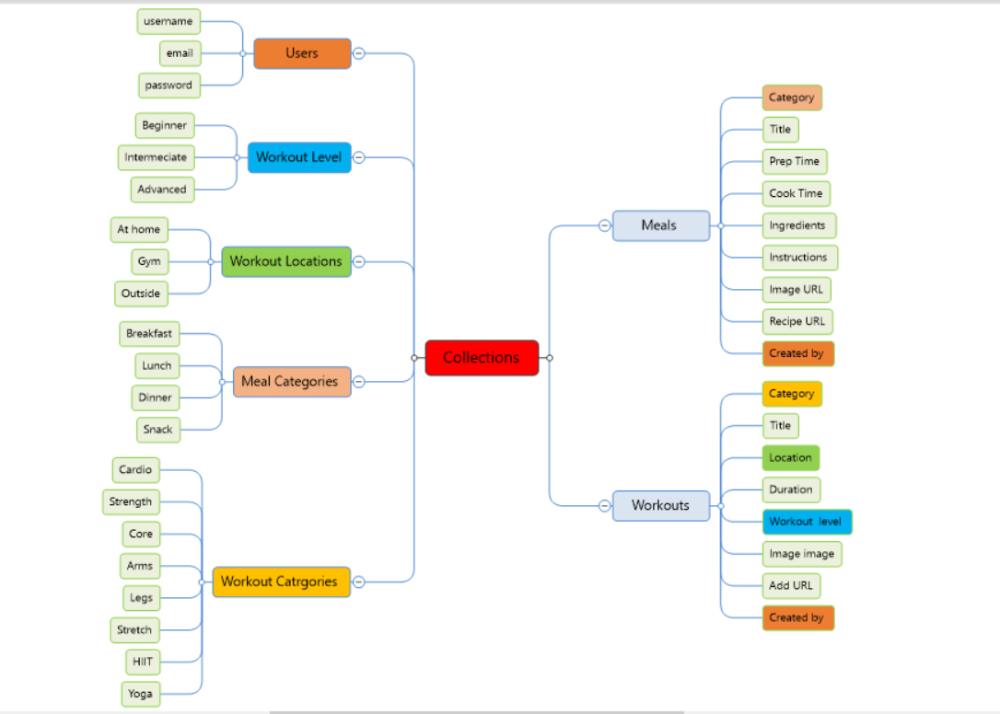
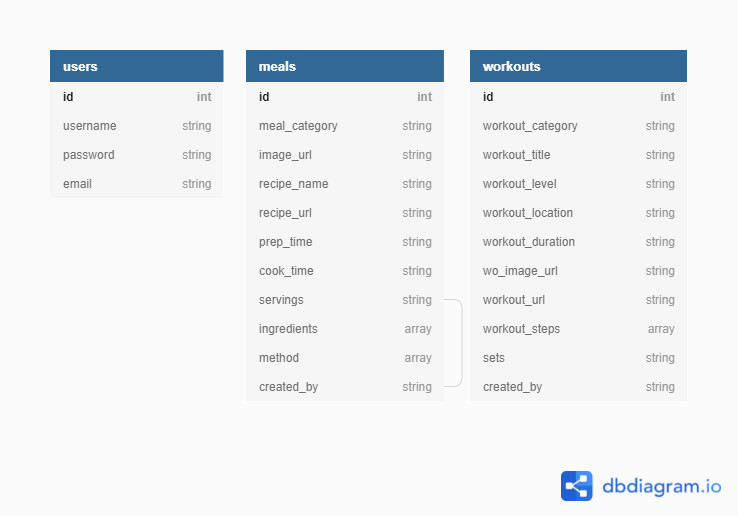

# Your Day, Your Way

## About

## UX
### Strategy 
Your Day Your Way is intended to help user’s share healthy meals and workouts. Alongside accessing meals and workouts on the site, users can add their own favourite meals and workouts to the database and easily access them from their profile. It is a site to allow the simple and easy storage of all user workouts and meals in one easily accessible place so they can plan their meals and workouts the way they want them to be!
### Target Audience
The target audience for this site are adults that would like to improve their health through improved diet and increased exercise. Anyone that would like to store their favourite meals and workouts in one easy place building up a reference library of their very own. This site would also benefit those that can feel overwhelmed by the variety of options available to them from multiple sources.
### User Stories
1.	I would like to understand the sites purpose.
2.	I would like to understand what the site offers so I can make an informed decision around whether register or not.
3.	I want the registration process to be simple.
4.	I would like logging in and logging out to be easy.
5.	I would like the sites navigation to be intuitive.
6.	I expect appropriate feedback from interactive elements.
7.	I would like to upload my own images.
8.	I want to be able to add, edit and delete my own content.
9.	I would like to access my own content from my profile page.
10.	I would like to be able to contact the site admin.
11.	I would like to view content uploaded by everyone.
12.	I would like to add my own as well as other site users’ content to my profile.
13.	I would like to be able to delete my account.

### Site Goals
- To allow users to add their own meals and workouts. 
- Encourage a healthier lifestyle with likeminded people.
- Allowing users to favourite the content they like and add it to their profile
## Scope
### Planned features: Backend and frontend development 
- CRUD functionality 
- Use MongoDB non-relational database to store meals and workouts 
- Use MongoDB to store all user login/profile information 
- Register user functionality 
- Login functionality
- Landing page with information on site purpose
- Navigation (not on Landing page)
- User profile 
  

## Structure
The Visio diagram below demonstrates the information architecture and flow of the site. The architecture has been designed to fulfil the user stories and scope of the project and is further elaborated in the Features and Testing sections of this project. 

### Database Schema
MongoDB non-relational database was for this project and the structure is outlined below. The data consists of several collections forming a one-to-many relationship of key/value pairs. All of the data is text based and stored as strings or arrays. The exact composition of which can be seen in the diagram below:

## Validation and Security
Validation and security measures have been put in place for:
- Email – users are unable to submit an email address that does not follow a regular email pattern. They will be notified that their entry is not valid.
- Username – must meet a minimum number of characters and fulfil the predetermined Regex pattern. The user will be notified if this pattern is not met and what the user must do to meet the requirement. On registration, incoming username’s are checked against the current usernames in the database and duplication is denied.
- Password – on entry, the password must meet the Regex pattern and minimum number of characters to be accepted. If this requirement is not met the user is notified. On acceptance, passwords are salted and hashed using werkzeug.security and securely stored in the database.
- Login – when logging in the user’s username and password must be identical to the matching records in the database. If one or both do not match the user is not informed which is incorrect, rather a flash message informs them that EITHER their username or password is incorrect. On successful login, the user is assigned a session cookie.
### Backend environment:
MongoDB, Cloudinary and Flask Mail connection details are stored in an env.py for development. For security reasons the env.py file is set to .gitignore and never pushed to GitHub. All API connection details are not visible to users and stored in Heroku throughout production.
## Features 
### Design
### Skeleton

#### Wireframes
#### Home

#### Register

#### Log In

#### Profile

#### Meals

#### Workouts

#### Contact

## Technologies
- HTML5 – used to complete the structure of the site.
- CSS3 - used to style the presentation of the content on the site.
- JavaScript & jQuery - were used for front-end dynamic interaction
- Python – was incorporated as the back-end logic and the means to run/view the site. 
Python Modules: 
   - dnspython==2.1.0
   - Flask==2.0.1
   - Flask-Mail==0.9.1
   - Flask-PyMongo==2.3.0
   - itsdangerous==2.0.1
   - pymongo==3.12.0
   - Werkzeug==2.0.1
- MongoDB - used to create the non-relational document databases (collections) and data storage for this project.
- Materialize - used through the website to assist with layout and responsiveness and incorporated JQuery functionality and form validation.
- Cloudinary API – installed as the means to allow the users to upload their own images.
- Flask Mail – used as the main form of email delivery for the site.
- Google Fonts – provided the fonts for this site.
- GitHub - is the hosting platform used to store the source code for the site.
- Git - is used as version control software to commit and push code to the GitHub repository where the source code is stored.
- Heroku - to deploy the live website.
- Balsamiq - was used to create wireframes for 'The Skeleton Plane' stage of UX design.
- Font Awesome - icons displayed throughout the site are taken from Font Awesome.
- Favicon.io was used to make the site favicon

